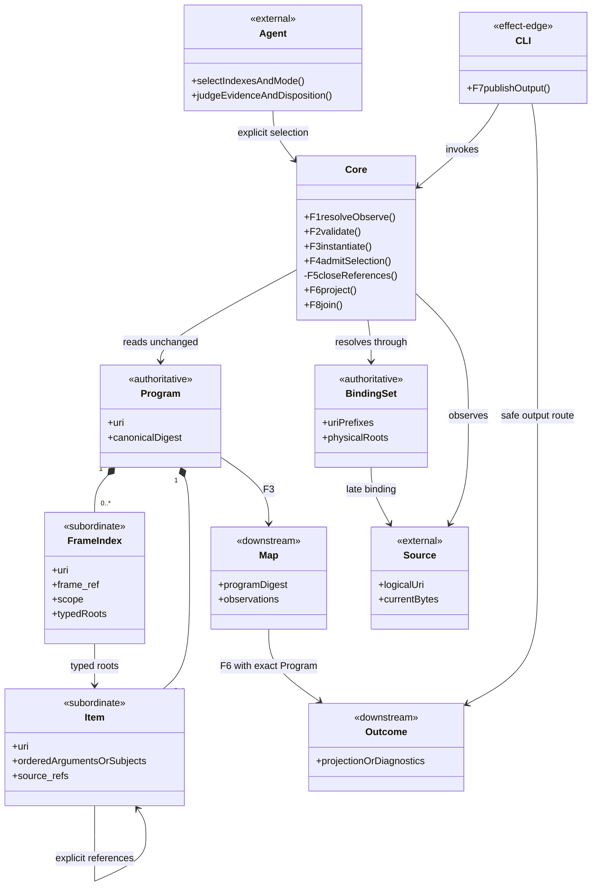
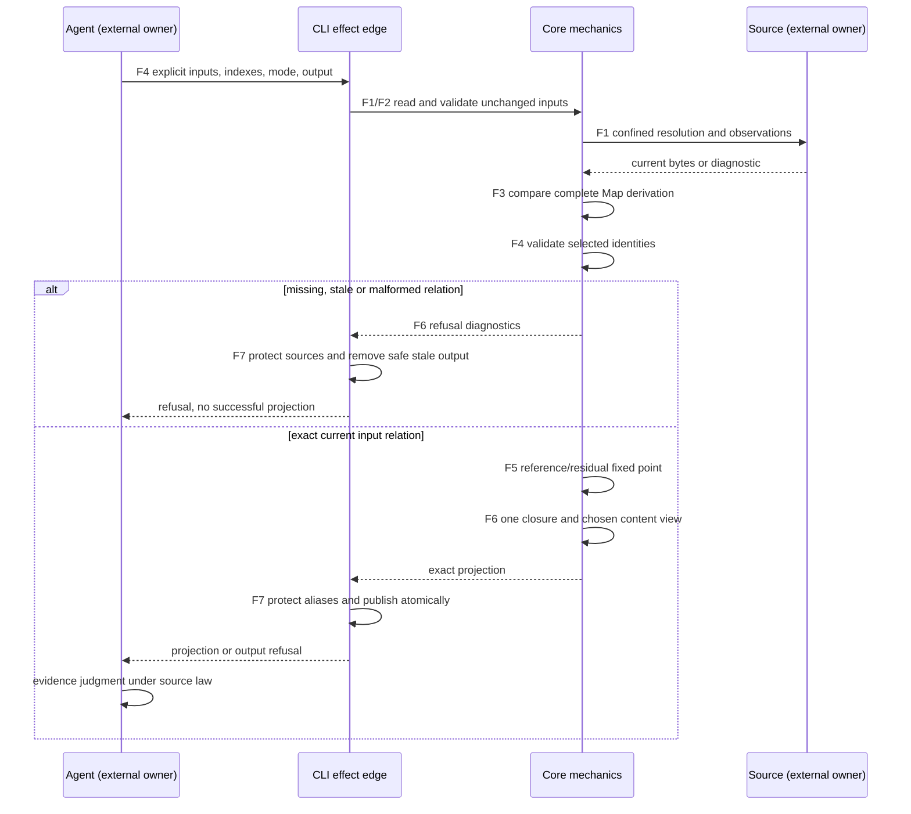
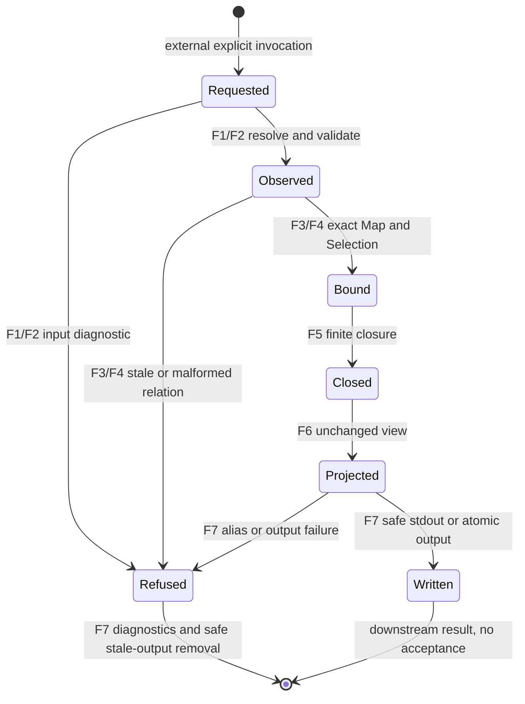

# Core Design

The conserved MVP has four boundaries:

1. the native skill instructs an LLM to author an axiomatic program;
2. the resolver late-binds logical URIs to exact resources; and
3. the validator checks declared mechanics and derives a read-only logical map.
4. the Executive LLM chooses frames and ordered labeled text; the joiner only
   concatenates those strings.

No semantic acceptance service, carrier, orchestration runtime, automatic frame
selection, or prompt-template engine belongs in this cut.

## Monorepo Placement

The source project may reside at `axiom_indexer/` under a coordination-only
repository root. Its Product Definition, relative paths, tool behavior, and
canonical native skill remain project-local. A root discovery link may expose
that skill without copying it or granting authority. Co-location with
Specification Methodology or STDO Representation creates no Product identity,
composition, or permission to substitute mutable sibling source for an exact
released dependency.

## Release-Coupled Realization

The implementation remains generic and contains no embedded Source STDO
version switch. Each release candidate binds that unchanged mechanics payload
to one exact installed STDO cut and uses the same product-local cut suffix in
the distinct `axiom_indexer` release namespace.

STDO Representation supplies and owns the corpus-specific Axiomatic Program.
It invokes the exact released Axiom mechanics to validate that program and
instantiate its logical map. A changed Source STDO member can therefore require
semantic re-authoring and map regeneration in Representation without creating
an ad hoc semantic branch inside the Axiom implementation.

## Frame projection design authority

This is the T009 `frame-projection-1` increment, derived from Product
`#frame-index-projections`, PROJECTION-001..008, PROGRAM-008/009,
AUTHORING-007 and the conserved resolution, validation and joining requirements.
Exact installed STDO `v2.5.0-rc.4` governs construction, including Design Module
Method 4B, 5A and 5E. This complete author design candidate is frozen before
implementation for root's design/requirements assessment. Co-evolution is
provisional evidence until that assessment is consumed; the Writer does not
self-ratify the design or claim promotion, release or acceptance.

The affected material relations are completely selected below. New ambiguity
re-enters this design before the affected implementation is promoted. Source
authors own meaning/dependencies, frame owners own evaluation contracts, and
agents select indexes and judge evidence. Axiom checks declared mechanics.
Representation owns STDO-specific chains and frame membership.

## Ontology and invariant reconstruction

The following stable names belong to this versioned design, not a new program
vocabulary. Their governing meaning comes from the cited Product requirements.

| Entity | Identity, ownership and relationships |
|---|---|
| Program | Author-owned URI and exact canonical value; owns symbols, clauses, residuals and optional frame indexes. Never mutated by code. |
| Dependency | An existing ordered role/ref clause argument; every local ref is a closure edge. The vocabulary owner supplies its interpretation. Literal arguments remain ordered qualifications. |
| FrameIndex | Author-owned unique URI, one declared frame, nonblank scope text, typed clause/residual root sets and nonempty source refs. Subordinate to Program and the source-owned frame. |
| Observation | Resolver-owned evidence binding one source URI to current file digest through an invocation-local Binding Set. Physical paths are not semantic identity. |
| Map | Downstream deterministic view binding the exact Program and complete observations; existing ordered clause arguments/reverse adjacency retain dependencies. |
| Selection | Invocation-owner-selected nonempty unique index URI set and one mode. An operation input, not a persistent carrier or applicability decision. |
| Closure | Least finite set containing selected roots, all local supporting references and referenced symbols, included residual subjects, and residuals affecting included items. Shared identities occur once. |
| Projection | Downstream reference-only or materialized view of one Closure, with exact Program/Map/index/frame/scope/basis/observation bindings. |
| Refusal | Structured diagnostics, no successful projection. Safe stale output is removed; an unsafe input/source alias is preserved and explicitly diagnosed. |

| ID | Invariant and admitted domain | Requirements |
|---|---|---|
| I1 | Every index has one globally unique absolute URI, one declared frame, explicit scope, correctly typed roots and source grounding. At least one root is selected. | PROGRAM-008; PROJECTION-001 |
| I2 | Closure follows all local argument refs without role interpretation, included residual subjects, and residuals whose subjects intersect closure. Fixed-point traversal terminates on cycles without judging soundness. | PROGRAM-009; PROJECTION-002/006 |
| I3 | Both modes retain identical selection, identities, ordered role/ref/literal links, residual/source routes and provenance. Materialized items equal original Program values. | PROJECTION-003 |
| I4 | The supplied Map equals deterministic instantiation of the valid Program and complete current observations, including its digest. A stale whole-map basis refuses projection even if some selected sources remain unchanged. | PROJECTION-004; RESOLUTION-005 |
| I5 | Output cannot overwrite/remove Program, Map, Binding Set or any resolved source, including aliases. Refusal produces diagnostics, never a newly successful view. | PROJECTION-005 |
| I6 | Programs without indexes retain old reports and map bytes. Join remains unchanged. Projection supplies no applicability, implication evaluation, acceptance or authority. | PROGRAM-008; PROJECTION-006/007 |

## Function ontology and dependency views

| Function | Inputs -> result or refusal | Authority and composition |
|---|---|---|
| F1 resolve-observe | URI + Binding Set -> confined file/fragment + digest, or diagnostic | Existing Resolver, read-only; retain attempted confined targets for output protection even when a fragment is invalid. |
| F2 validate | Program + F1 -> complete mechanical report | Existing validation plus optional index shape/identity/kind/source checks. Indexed programs also observe residual re-entry files. |
| F3 instantiate | Exact valid Program + F2 report -> Map | Existing projection plus `frame_indexes` only when declared. |
| F4 admit-selection | Program + explicit index set + mode -> selected declarations, or diagnostics | Caller selects; code rejects missing, wrong-kind, unresolved and duplicate selections. |
| F5 close-references | F4 roots + valid Program -> least reference/residual closure | Pure visited-set traversal; no inverse clause inference, role interpreter or condition evaluator. |
| F6 project | F2 + exact F3 equality with supplied Map + F4/F5 -> derived view | One closure path, two content views; complete observation equality is the freshness witness. |
| F7 publish-output | F6 result/refusal + output route + protected inputs/sources -> output or diagnostic | CLI effect edge only; safe atomic file replacement or stale-output removal. No source repair or automatic retry. |
| F8 join | Caller-ordered labels/text -> exact UTF-8 concatenation | Existing pure joiner, unchanged. |

The higher-order operation is `F7(F6(F2, F3, F4, F5))`, with F1 supplying
observations. F2 precedes reliance on item shape; F4 never substitutes a frame;
F5 cannot drop a referenced premise/exception; F7 follows route protection.
Composition adds no authority. A caller repair and new invocation is the only
retry path. Native semantic-use assessment remains PROJECTION-008 evidence,
not another code function.

Whole-family contraction: both modes are variants of F6 over the same F5
closure. Separate mode-specific selection/traversal is rejected because it
could diverge. F1-F3/F8 reuse existing boundaries; F4-F6 remain in `ac.py`.
Existing role-labelled arguments are the irreducible dependency atoms; a new
premise AST, registry, service, persistent selection store or rule engine would
duplicate meaning. Full admitted `M_b`, GTL and automatic selection are excluded.

## IACS and public realization

The complete active carrier set is authoritative Program and invocation-local
Binding Set, and downstream Map plus the Projection/diagnostic outcome family.
Source bytes remain external authority. Indexes, arguments, URI sets,
observations and diagnostics are subordinate payloads. The output route is CLI
effect-edge input. Existing JSON dictionaries realize the public contract;
explicit validation owns global reference/identity checks.

Schema version 1 gains optional `frame_indexes`, a sorted array of closed rows:
`uri`, `frame_ref`, `scope`, `clause_refs`, `residual_refs`, `source_refs`.
Scope is nonblank text. URI sets are canonical/duplicate-free, and the union of
root sets is nonempty. Index IDs cannot collide with Program or other items.
Root sets accept only their named kinds. Indexes are not clause operands.
An absent field preserves old validation/map shape; an empty array is valid but
provides no selectable index.

For indexed Programs, Map adds `frame_indexes` keyed by URI and containing each
unchanged declaration. Existing clauses and `outgoing_clause_refs` are the
dependency view; there is no parallel edge language. Indexed Programs record
every residual re-entry file observation. Old Programs retain their original
observation population and map bytes.

```sh
python3 build_tenants/core/code/ac.py project \
  --program program.json --map map.json --bindings bindings.json \
  --frame-index urn:example:index:transfer \
  --frame-index urn:example:index:recovery \
  --mode reference-only --output projection.json
```

The index option repeats. Operation validation requires at least one index and
an explicit `reference-only` or `materialized` mode. There is no default frame
or fallback. Success without an output path emits the view to stdout; with a
path it writes the view and emits a report. Refusal emits a structured report
and status 1 (mechanical refusal) or 2 (input/output failure).

Both views contain `kind`, `schema_version`, `mode`, `program_uri`,
`program_sha256`, `map_sha256`, `calculus_ref`, `source_basis`, selected
`frame_indexes`, `frame_refs`, used `vocabulary_refs`, `closure`,
`clause_relations`, `residual_routes`, `source_routes`, `resolved_sources` and
canonical `projection_sha256`. Closure contains sorted symbol/clause/residual
URI sets. Clause relations retain URI, type, operator and exact ordered
arguments, including literals. Residual routes retain URI, kind, subjects and
re-entry refs. Materialized mode additionally supplies unchanged original
`symbols`, `clauses`, `residuals` rows. Reference-only omitted prose resolves by
the exact Program URI/digest and local item URI. Index scope is unchanged.

View observations cover calculus, selected frames/index sources, included item
sources and residual re-entry routes; Map digest binds the complete checked
observation set. Physical paths, timestamps and incidental counts do not enter
semantic identity or projection digests.

## Domain model



## Sequence model



## State model and effect boundary



Invocation state is ephemeral. Input/source owners undergo no lifecycle
transition. Refusal neither retries nor repairs meaning. Output protection
compares paths and existing inode aliases with Program/Map/Binding Set and all
attempted confined source targets, including invalid-fragment files. An unsafe
or unresolved source-protection route is neither written nor removed and is
explicitly diagnosed; other refusals remove the safe stale projection. Success
uses temporary sibling-file replacement and cleans temporary files on failure.
The caller supplies stable read inputs and exclusive output scope for one
invocation. No cross-process locks, snapshot isolation or crash transaction is
claimed. Only the requested derived file is an effect target.

## Cross-view assessment and qualification

These are author design-conformance results. Root supplies the independent
design/requirements disposition; implementation evidence remains pending.

| Axiom | Ontology evidence | Authority | Domain | Sequence/state | Native enforcement | Global enforcement | Design result; gap owner |
|---|---|---|---|---|---|---|---|
| I1 identity/scope | FrameIndex, F4 | author/frame owner | Program contains FrameIndex | F2/F4 -> Bound/Refused | JSON shape and URI fields | uniqueness, kind, frame and source validation | pass; implementation Writer |
| I2 closure | Closure, F5 | author owns edges | Item references Item | Bound -> Closed | finite visited set | explicit refs and affected-residual incidence | pass; implementation Writer |
| I3 mode equivalence | Projection, F6 | author | Map -> Outcome | Closed -> Projected | shared closure and exact content copy | ordered argument/literal comparison | pass; implementation Writer |
| I4 freshness | Observation, Map | source/resolver | BindingSet -> Source | Observed -> Bound/Refused | canonical digests | whole Map/observation equality | pass; implementation Writer |
| I5 effects | Refusal, F7 | caller output grant | CLI effect edge | Projected -> Written/Refused | path/inode checks, atomic replacement | protect inputs and attempted sources | pass; implementation Writer |
| I6 conservation | F1-F3/F8, exclusions | existing owners | Core | no acceptance transition | optional-field and unchanged join behavior | old-map and 15-test comparison | pass; implementation Writer |
| Semantic usefulness | external judgment | fresh agent | Agent | post-projection assessment | no interpreter | source/view disposition comparison | pending evidence; native Reviewer |
| GTL/runtime/M_b | excluded | outside selected scope | no carrier | no transition | not applicable | not applicable | not_applicable: no runtime selected |

The fixture has two overlapping frame indexes, one common rule, a consequence
with two premises, an exception, a literal qualification and an affected
residual. Positive cases compare both views, unchanged rows, shared identity,
relocation and repeatability. Counterexamples cover missing dependency,
wrong-kind/duplicate/absent selection, cycles, stale/missing/ambiguous sources,
omitted evidence or mismatched Map, and direct/symlink/hardlink output aliases
including invalid-source refusals. Run the existing 15 tests and new cases
normally and with `python -O`. Fresh-agent evidence separately distinguishes
satisfied, unsatisfied, exceptional and unknown task inputs.

Implementation remains in the existing executable, tests, design, code README
and canonical skill/schema/output contract. A bounded authoring fixture is
qualification material, not an extra engine. Existing relative child/native
routes and separate Product/release authority remain conserved.
