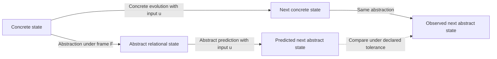

# Relational Meaning: Nearness, Reference Frames and Functional Equivalence

**Status**: Working paper
**Date**: 22 September 2026
**Origin**: Model developed by the repository owner in discussion; formalised
and researched in this draft.
**Authority**: Strategy material under [the strategy boundary](README.md).
**Evidence**: Proposed model, conditional deductions and cited research. The
experimental programme in this paper has not been executed.

## Abstract

This paper defines meaning as weighted relational organisation. Nearness
measures association within a reference frame. A frame selects the distinctions
needed to explain a bounded behaviour. Encoding establishes a contextual
relational state; decoding develops that state into an observable result.
The model aims to explain functions shared by different implementations,
including transformers, associative systems and aspects of human cognition.
Its validity depends on prediction: abstracting the evolving system must agree
with evolving its abstraction. A formal criterion identifies when a frame
discards necessary information. A constructed example shows how one relational
structure supports deterministic selection and probabilistic output. The paper
derives a conditional information bound, identifies the additional assumptions
needed for energy bounds, and applies the model to TypeSafe's typed decision
interface. Cross-implementation equivalence and biological applicability remain
empirical hypotheses.

## 1. Claim and scope

A functional model identifies the variables and relations that explain classes
of behaviour. Its predictions can survive changes to the mechanism that
realises them. Describing an architecture's operations does not by itself
identify that functional model.

The proposed model has four commitments:

1. Meaning consists of relationships among distinguishable patterns.
2. Association has strength and depends on context. Nearness expresses that
   strength within a selected frame.
3. A reference frame retains the distinctions relevant to a declared behaviour.
4. A transition law connects relational organisation to observable behaviour.

Here, meaning is a stipulated technical term. It includes relationships among
objects, symbols, actions, histories and possible outcomes. Conscious
experience, human interpretation and factual correctness are separate subjects.
An abstraction can faithfully predict a system's factual errors.

The model concerns emergent organisation: retained relationships should predict
system behaviour without reproducing every underlying operation. A retained
relationship is justified by the distinctions and predictions it preserves.
Its physical implementation may be distributed across many components.

The claims have different evidential status:

| Claim | Status |
|---|---|
| Meaning denotes weighted relational organisation | Definition |
| Nearness can be represented by a specified metric or association measure | Modelling choice, subject to its mathematical conditions |
| An abstraction must preserve the behaviour it claims to explain | Validity criterion |
| Particular frames and nearness measures explain transformer behaviour | Empirical hypothesis |
| Different implementations can instantiate a common relational dynamics | Hypothesis to test for a named task and scope |
| Human cognition instantiates the same functional model | Bounded research hypothesis |
| A fixed number of distinguishable abstract states requires sufficient representational capacity | Conditional deduction |

"Reference frame" in this paper denotes a behavioural abstraction. Its use
here establishes no equivalence with STDO's governed reference-frame concept.

## 2. Relational structure and nearness

### 2.1 What the structure contains

Let a system have concrete state $s$, relevant input $u$, and context $c$.
The concrete state includes the history, memory and configuration needed to
describe the selected evolution. A frame $F$ supplies an abstraction
$\alpha_F$ into a representation space $Z_F$:

$$
z = \alpha_F(s).
$$

The relational structure describes which patterns are associated, how strongly,
and under which conditions. Relations can concern ordered combinations and
roles. A pairwise graph is one possible representation; higher-order relations
may require additional state, conditional operators or hyperedges.

An unweighted graph records connectivity. A weighted structure adds relative
association. A metric adds specific geometry. A transition rule adds dynamics.
These ingredients have separate jobs in a concrete model.

For learned systems, experience and the training objective shape the
relationships. Experience can include a corpus, synthetic examples and
interaction. Architecture and optimisation constrain which relationships are
represented. Corpus membership alone does not determine one unique geometry.

### 2.2 The meaning of near

Nearness names associative proximity. Its spatial origin provides an intuition:
patterns judged near under a frame have a stronger declared association.
Nearness has no intrinsic unit of time, computation or physical energy.

A metric realisation supplies $d_F(z,z')$ with non-negativity, identity,
symmetry and the triangle inequality. An affinity can then be defined as a
decreasing function of that distance. The worked example in section 5 uses
this construction.

Associative influence can also be directional. A strong tendency for one
pattern to evoke another need not be reciprocal. Such a model must either
separate a symmetric geometry from directional dynamics, or explicitly use a
directed dissimilarity or association score. A weighted graph does not
automatically supply a metric. Negative log transition probability does not
automatically satisfy metric axioms.

This distinction preserves the intended concept of nearness while making each
realisation testable. The measure, its domain and its relation to behaviour
must be specified before evaluating its predictions.

### 2.3 Attraction and attractors

Nearness can describe attraction when attraction means a conditional tendency
to evoke, select or influence another pattern. That interpretation requires a
rule connecting association to the predicted effect.

A dynamical attractor makes a stronger claim. It requires a state or set toward
which trajectories converge, or around which they remain, under specified
dynamics. An association score alone establishes no convergence property.

Modern Hopfield networks provide a concrete connection: Ramsauer and colleagues
derive an associative-memory update equivalent to transformer attention under
their construction. Their analysis supplies energy and fixed-point properties
for that system. Extending those properties to a complete transformer requires
additional argument. [Ramsauer et al. (2021)](https://arxiv.org/abs/2008.02217)

## 3. Reference frames as abstraction

A frame identifies the subject, relevant inputs, retained variables, observable
behaviour, prediction horizon and acceptable error. The frame can be fixed by
a task or selected through a declared rule.

A change of coordinates can preserve all information. A projection can discard
information. This paper uses a frame to include the latter operation when the
task permits it. A lower-dimensional representation is useful when it retains
the distinctions needed for prediction.

Lower dimension is one form of reduction. Fewer distinguishable states, fewer
relations or less retained history can also produce a smaller abstraction.
Parameter count, activation width and the number of possible domain states
measure different things. They cannot be substituted for one another.

The frame's adequacy depends on the question. Two states can be equivalent for
classification and different for planning. Two implementations can be
equivalent for their decisions and different for their energy consumption.
Changing the question changes the distinctions the frame must retain.

The information bottleneck method formalises a related objective: compress a
signal while preserving information relevant to another variable. It supplies
one established approach to selecting a useful representation. The present
proposal additionally asks whether a retained representation supports the
claimed dynamics and cross-implementation comparisons.
[Tishby, Pereira and Bialek (1999)](https://arxiv.org/abs/physics/0004057)

Frame selection is part of the predictive model. If the frame changes during
execution, the model must specify that change using available state and inputs.
Choosing a frame after observing the result cannot qualify a prediction.

## 4. Functional truth and predictive closure

### 4.1 Agreement between mechanism and abstraction

Let $P(\cdot\mid s,u)$ describe the concrete system's next-state distribution.
Let $K_F(\cdot\mid z,u)$ be the proposed abstract transition law. For a fixed
frame, the model claims:

$$
\mathcal{L}\!\left(\alpha_F(S_{t+1})\mid S_t=s,U_t=u\right)
\approx_{\epsilon}
K_F\!\left(\cdot\mid\alpha_F(s),u\right).
$$

$\mathcal{L}$ denotes a probability distribution. The approximation is measured
over a declared domain using a specified prediction discrepancy and tolerance
$\epsilon$. Discrete outcomes may use total variation; continuous states need
a discrepancy appropriate to the observable quantities. This prediction
discrepancy is distinct from the model's associative-nearness measure.

The selected output must also be recoverable through a declared abstract
readout, or be included in the retained state. Otherwise a constant projection
could satisfy the transition equation while preserving none of the task's
observable distinctions. The input interface is fixed for the comparison;
undeclared concrete state cannot enter through an extra context argument.

For deterministic evolution, the distributions reduce to single outcomes.
For probabilistic evolution, agreement concerns distributions rather than
matching individual samples.

This is the paper's functional truth criterion. The abstraction must preserve
the selected behaviour of the underlying system. A claim about how the system
causes that behaviour additionally requires interventions and a justified
mapping between concrete and abstract interventions.

### 4.2 A failure criterion

Suppose $\alpha_F(s_1)=\alpha_F(s_2)$. The abstract model receives the same state
for both cases. Under the same relevant input, it must therefore issue the
same abstract prediction.

If the concrete cases induce different next-state distributions after
abstraction, exact closure fails. If those distributions differ by more than
$2\epsilon$ under a metric discrepancy, no single prediction can be within
$\epsilon$ of both. This follows from the triangle inequality.

The failure identifies a missing distinction. Repair can retain another
variable, include relevant history, change the frame-selection rule or narrow
the prediction domain. Renaming both outcomes as near supplies no repair.

Computational mechanics provides a related established construction. It groups
histories by their predictive consequences and derives minimal predictive
representations under its assumptions. Those results motivate the search for
sufficient abstract states; their optimality theorems do not automatically
apply to the proposed frames here.
[Shalizi and Crutchfield (2001)](https://arxiv.org/abs/cond-mat/9907176)

### 4.3 Explanatory content

The state, frame, nearness measure and transition family must constrain
predictions before the test outcomes are observed. Parameters may be learned
on a training population and evaluated on held-out cases.

A relational account adds explanatory value when its retained structure
predicts behaviour under new inputs or interventions, and materially improves
on a comparable account that omits that structure. Defining nearness as
whatever the system subsequently selects makes the account circular.

An identity mapping satisfies preservation trivially. A claim of useful
abstraction additionally identifies the reduction achieved, or the common law
that transfers across implementations without reconstructing their mechanics.

One-step agreement qualifies one-step prediction. Longer trajectories require
their own error analysis and evidence. Learning dynamics require a model of
how relationships change; equivalence between frozen models does not establish
equivalence between their learning processes.

## 5. A constructed realisation

Consider a two-dimensional input state and two response prototypes:

$$
x=(0.8,0.8),\qquad m_A=(1,0),\qquad m_B=(0,1).
$$

Frame $F_1$ retains the first coordinate. Frame $F_2$ retains the second.
Each frame uses absolute distance on its retained coordinate. Define response
probabilities through:

$$
p_F(a\mid x)=
\frac{\exp\!\left[-d_F(\alpha_F(x),\alpha_F(m_a))^2/\tau\right]}
{\sum_{b\in\{A,B\}}
\exp\!\left[-d_F(\alpha_F(x),\alpha_F(m_b))^2/\tau\right]},
\qquad \tau>0.
$$

At $\tau=1$:

| Frame | Distance to A | Distance to B | Probability of A | Probability of B |
|---|---:|---:|---:|---:|
| $F_1$ | 0.2 | 0.8 | 0.646 | 0.354 |
| $F_2$ | 0.8 | 0.2 | 0.354 | 0.646 |

The frame changes which association dominates while the input and prototypes
remain fixed. A deterministic selector takes the nearer prototype with a
declared tie rule. A stochastic selector samples from the displayed
distribution. A third implementation returns the distribution directly.

This is a constructed one-decision instance of the model. Its numbers follow
from the declared equation. They provide no empirical evidence about a trained
transformer or a brain. They show that contextual framing, metric nearness and
deterministic or stochastic output can coexist in one explicit realisation.

A sequential realisation additionally declares how the selected result and
new input update state. That update determines the subsequent trajectory.

## 6. Mapping to transformer architecture

The proposed mapping assigns encoding the function of establishing contextual
relational state and decoding the function of producing an output trajectory.
"Lookup" denotes associative localisation in this account. Encoding can
construct a representation that was never stored as a discrete address.

The original transformer computes contextual representations through attention
and feed-forward layers. Its decoder conditions successive outputs on earlier
outputs. Learned attention projections offer candidate subspaces for a frame;
the residual stream and expanding feed-forward layers prevent a general claim
that the architecture continually reduces dimension.
[Vaswani et al. (2017)](https://arxiv.org/html/1706.03762v7)

Attention also separates selection from effect. Query-key compatibility
determines attention weights. Value and output transformations determine what
the selected information contributes. Strong attention therefore supplies no
general proof of movement toward the attended pattern's embedding. Any claim
that nearness predicts attraction must name the effect being predicted.
[Elhage et al. (2021)](https://transformer-circuits.pub/2021/framework/index.html)

An empirical mapping must identify:

- the concrete state and execution step being abstracted;
- the representation and frame-selection rule;
- the nearness measure and transition law;
- the output or internal behaviour being predicted; and
- the conditions under which the mapping ceases to hold.

Model parameters, current activations and domain states remain distinct.
Parameters implement transformations; activations describe an execution;
domain states are subjects represented by that execution.

Layer-to-layer evolution and token-to-token generation also need separate
time coordinates. A decoder-only architecture can perform contextualisation
and generation within one stack. The functional distinction does not require
two physical modules.

The proposed traversal follows evolving relational state. It need not follow
fixed stored edges, a shortest path or one global energy gradient.

## 7. Functional equivalence across implementations

Two implementations can be compared through mappings into the same abstract
state space. If corresponding states and inputs produce the same abstract
transition law and observable behaviour over the selected scope, they are
functionally equivalent within that frame.

For approximate equivalence, both implementations need stated error limits
against the common model. Agreement on a few final outputs is insufficient to
establish corresponding internal relationships or intervention responses.

| Candidate implementation | Proposed correspondence | Distinction to test |
|---|---|---|
| Transformer | Distributed contextual representation and conditional evolution | Dependence on history, composition and selected representation |
| Explicit weighted relational system | Stored relations with declared update and selection rules | Storage growth, expressiveness and generalisation |
| Associative or recurrent system | State evolves under learned or declared relationships | Convergence, interference and memory capacity |
| Human cognitive process | Experience-dependent associations and task-dependent framing | Behavioural and neural evidence for the particular task |

This comparison makes replacement an engineering question: which relationships
and transitions must survive, and which physical mechanisms can change?
Preserving behaviour leaves implementation choices whose memory, learning,
latency and energy properties can differ.

Human relational-map research provides bounded supporting evidence. Garvert
and colleagues found hippocampal-entorhinal representations sensitive to
learned abstract relationships among objects. This supports examining a
relational frame for that class of task. It does not establish a general
equivalence between human cognition and transformers.
[Garvert, Dolan and Behrens (2017)](https://elifesciences.org/articles/17086)

A shared behavioural prediction can identify a candidate common function.
Claims about a shared causal organisation need corresponding interventions
and evidence that the proposed relation carries the effect in each system.

## 8. Determinism, ambiguity and domain complexity

Three design choices are independent:

| Choice | Alternatives |
|---|---|
| How relationships are obtained | Authored, learned, or combined |
| What the output represents | A selected result, uncertainty over results, or both |
| How execution selects an outcome | Deterministic rule or stochastic selection |

A deterministic computation can return the same probability distribution for
the same complete state and input. Probabilistic representation does not
require random execution. A deterministic implementation can also use learned
weights and generalise beyond individually authored cases.

The probability vector and a sampled outcome are different observables.
Replacing sampling with a fixed maximum-probability selection changes the
distribution of selected outcomes. An equivalence claim must identify which
observable it preserves.

The motivating complexity claim concerns the number of distinctions a task
requires. As relevant combinations increase, explicit case enumeration may
become expensive. Shared relational structure can permit a more compact rule
or learned representation when the domain contains exploitable regularities.

Raw state count supplies no universal threshold at which probabilistic methods
become preferable. Deterministic algorithms can exploit structure; learned
models can fail to capture it. The comparison must hold the task distribution,
required accuracy and resource limits explicit.

A practical comparison asks whether exact computation is tractable under the
task's constraints, and whether inference or approximation meets its error
budget. The surrounding system determines how uncertainty affects action.

## 9. Information and energy bounds

The abstraction can make a resource question precise before a particular
implementation is chosen. Begin with the distinctions required to predict the
selected behaviour.

Suppose an exact finite frame requires $N$ mutually distinguishable predictive
classes. A fixed-width digital representation of those classes requires at
least:

$$
b\geq\lceil\log_2 N\rceil.
$$

With fewer bits, two required classes share a code. The abstraction then loses
a distinction it promised to preserve. This is a counting bound at the
representation boundary. It supplies no transformer parameter count, training
cost or total machine-memory bound. Approximate prediction and variable-length
coding require different assumptions.

An energy bound needs a physical implementation model. Material assumptions
include precision, accepted error, completion time, storage, communication,
temperature and irreversible information loss. Training and inference also
have separate costs and amortisation periods.

Bennett's reversible-computation construction shows why an abstract logical
operation has no universal fixed dissipation cost. Information erasure and the
conditions of physical operation matter. A claim about transformer energy
limits must connect required information processing to those conditions.
[Bennett (1973)](https://www.cs.princeton.edu/courses/archive/fall04/cos576/papers/bennett73.html)

The model can therefore guide two distinct investigations: identify necessary
representational distinctions, then assess the resource cost of preserving and
using them under declared constraints. A resource saving counts as equivalent
function only while the required behaviour remains within its error bound.
API price and elapsed time alone establish no physical energy measurement.

## 10. TypeSafe as a bounded decision frame

TypeSafe's public Jev interface takes state and typed questions. It returns
choices, scores or probabilities, and evaluates questions independently in
parallel. Its documentation recommends decomposing questions and combining
their results in code.
[TypeSafe documentation](https://docs.typesafe.ai/introduction)

The proposed interpretation maps a typed question to a task frame. Its allowed
outcomes and criteria declare the distinctions the caller wants. State provides
the evidence against which those distinctions are evaluated. The returned
decision or distribution exposes a bounded result from a richer relational
process. This is an interpretation of the public contract; it makes no claim
about undisclosed internals.

This interpretation yields a testable engineering hypothesis. When a task needs
only specified independent decisions, an implementation specialised for those
decisions may avoid work required by an extended generated response. Compare
systems at matched task coverage, accuracy and calibration, then measure
latency, resource use and energy separately.

Output restriction alone does not establish cheaper inference. A yes/no
question can require substantial reasoning. Independent evaluation also cannot
resolve a dependency in which a later question requires an earlier answer
unless the surrounding composition supplies that answer.

Type validity, determinism and factual accuracy remain separate properties.
An output can belong to the declared type and still select the wrong outcome.
The caller's output vocabulary can also omit a necessary distinction. The
appropriate test includes cases requiring abstention, an additional category
or sequential evidence gathering.

The model's contribution would be a prediction of which task frames preserve
capability under this specialisation, and where the retained distinctions or
declared composition become insufficient.

## 11. Experimental programme

A qualification instance fixes one system, task distribution, prediction
horizon, frame, nearness measure, transition family and error criterion.
It separates fitting data from evaluation data. It also records the resource
constraints and the baselines used for comparison.

| Test | Prediction under the selected model | Evidence against that model |
|---|---|---|
| Predictive closure | States merged by the frame have sufficiently similar retained futures under corresponding inputs | A merged pair exceeds the declared discrepancy bound |
| Frame relevance | Perturbations declared irrelevant preserve predictions; removing a distinction claimed necessary degrades them | A claimed invariance or necessity fails |
| Nearness contribution | The chosen measure and transition law predict held-out behaviour better than matched controls with relations removed or shuffled | Comparable predictions survive destruction of the proposed relational structure |
| Context change | A declared change of frame predicts a specified change in association or outcome distribution | The predicted change fails or requires selecting a new frame after the result |
| Intervention mapping | Corresponding concrete and abstract interventions produce the predicted effects | Similar outputs conceal different intervention responses |
| Implementation transfer | A common law predicts both implementations within declared error and scope | Transfer requires an outcome-specific reconstruction of the model |
| Deterministic realisation | Fixed state and input produce the declared repeatable result or distribution | Unmodelled state changes the result beyond the allowed tolerance |
| Typed specialisation | A specified subset of tasks retains capability with lower measured resource use | Savings depend on losing required accuracy, coverage or decision composition |

These tests evaluate a particular formalisation. Failure can reject its frame,
measure, transition rule or scope. The broad definition of meaning does not
become an empirical result merely because one formalisation survives.

The first experiment should use a bounded associative task with inspectable
state. Compare an explicit relational implementation and a small learned
implementation. Declare the frame before evaluation. Include ambiguous cues,
context changes, held-out combinations and pairs designed to expose lost
distinctions. Measure whether the common abstraction predicts each system and
whether its proposed relations explain intervention effects.

Only after that mapping qualifies should the same law be tested on a broader
architecture or a human task. The resulting evidence would support a named
functional equivalence with a recorded boundary.

## References

- Vaswani, A. et al. (2017). [Attention Is All You Need](https://arxiv.org/abs/1706.03762).
- Elhage, N. et al. (2021). [A Mathematical Framework for Transformer Circuits](https://transformer-circuits.pub/2021/framework/index.html).
- Ramsauer, H. et al. (2021). [Hopfield Networks Is All You Need](https://arxiv.org/abs/2008.02217).
- Tishby, N., Pereira, F. C. and Bialek, W. (1999). [The Information Bottleneck Method](https://arxiv.org/abs/physics/0004057). Allerton conference paper; arXiv posting, 2000.
- Shalizi, C. R. and Crutchfield, J. P. (2001). [Computational Mechanics: Pattern and Prediction, Structure and Simplicity](https://arxiv.org/abs/cond-mat/9907176). Journal of Statistical Physics 104, 817–879; preprint, 1999.
- Garvert, M. M., Dolan, R. J. and Behrens, T. E. J. (2017). [A Map of Abstract Relational Knowledge in the Human Hippocampal–Entorhinal Cortex](https://elifesciences.org/articles/17086). eLife 6:e17086.
- Bennett, C. H. (1973). [Logical Reversibility of Computation](https://www.cs.princeton.edu/courses/archive/fall04/cos576/papers/bennett73.html). IBM Journal of Research and Development 17, 525–532.
- TypeSafe AI (2026). [Introduction](https://docs.typesafe.ai/introduction). Public Jev interface documentation, accessed 22 September 2026.
